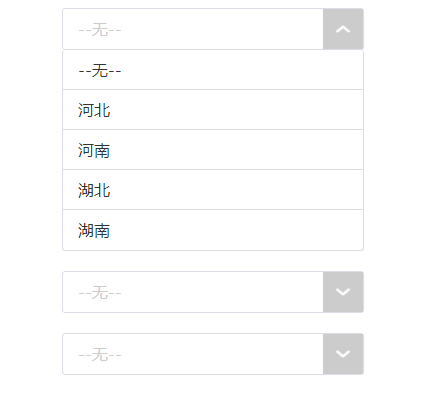

### demo[https://xiaoyaxiaoyao.github.io/-select/select.html]
### 仿 select 框 
- 展示图片


- 调用方法
  ```js
   // 调用
  window.onload = function(){
    var select1 = new selectFun("select_K");
    select1.init(select1);
    var select2 = new selectFun("select_K1");
    select2.init(select2);
    var select3 = new selectFun("select_K2");
    select3.init(select3);
  }
  ```
- 说明：该插件有原生js的构造函数编写，代码结构简单易懂。
- 请勿修改 select_down / downUp / placeholder / up 这几个变量名
  ```js
    /** 变量说明
    *   selectFrame 数值展示框 
    *   optionlist  下拉框中的每一项的集合
    *   selectDownFrame&select_down  下拉列表
    *   placeholder  无数值时数值展示框的字体颜色
    *   downUp    向下的下拉箭头图标
    *   up        向上的下拉箭头图标
    */
  ```
